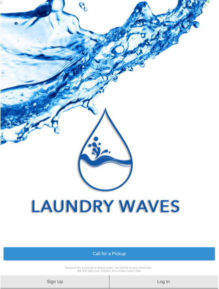
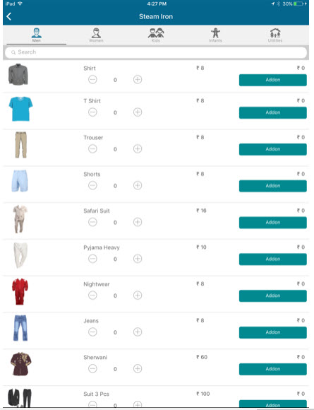

# Laundry Waves
Laundry Waves is the first production level hybrid mobile app developed completely using Ionic v1 and is fully functional.

The app is live on Apple's App Store and is gaining popularity in Hyderabad City.

# Links to the Mobile App #
Apple App Store - https://itunes.apple.com/bb/app/laundrywaves/id1198487653?mt=8

# LaundryWaves v1.0.0 #
## Languages Used ##

* JavaScript
* AngularJS
* Ionic
* NodeJS

## How to Setup ##

### Basic Setup ###
run **npm install**

run **bower install**

run **ionic platform add android**

run **ionic platform add ios**

### run livereloadable project ###
run **ionic serve**

## Screenshots ##

# !! Important !! #
This source code is for educational purposes only.
The live source code of Laundry Waves is present as a private repository.
